# Разработка информационной системы для студии звукозаписи "OUT Records"

Для оптимального функционирования базы данных необходимо иметь
справочники, в которых мы сможем хранить информацию, описывающую
различные списки элементов.

## 3.1. Создание справочников конфигурации

В разделе 2 были определены справочники, необходимые для создания
конфигурации .

1)  Клиенты,

2)  Услуги,

3)  Сотрудники,

4)  Оборудование.

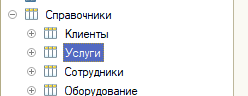

Рисунок 1 -- Справочники конфигурации

Рассмотрим подробнее каждый справочник и его назначение. Справочник
«Сотрудники» содержит информацию обо всех сотрудниках, работающих в
студии звукозаписи, включая информацию об их образовании и семье.
Табличные части позволяют вносить и редактировать информацию о детях
сотрудника, с согласия работника. Можно указать ФИО ребенка, а также его
дату рождения.

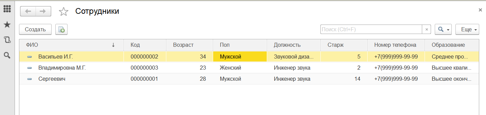

Рисунок 2 -- Форма списка справочника «Сотрудники»

Форма элемента содержит реквизиты, позволяющие более подробно узнать ту
или иную информацию о сотруднике. При приеме на работу, сотрудник
указывает свой контактный телефон для быстрой связи в экстренных
ситуациях. Реквизиты «Номер телефона» позволяют быстро найти эту
информацию руководящим лицам и связаться с подчиненным.

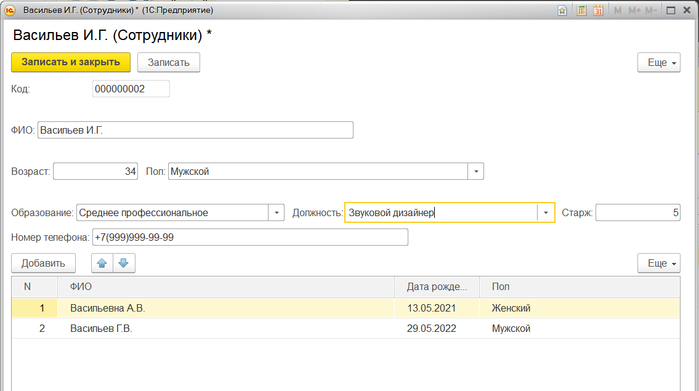

Рисунок 3 -- Форма элемента справочника «Сотрудники»

Таким образом, справочник «Сотрудники» является важным объектом
конфигурации и дает полную информацию о должности и об образовании того
или иного сотрудника.

Следующий справочник -- «Клиенты». Является также важным по значимости
объектом проектируемой системы. Данный справочник содержит информацию о
постоянных и новых клиентах студии звукозаписи.

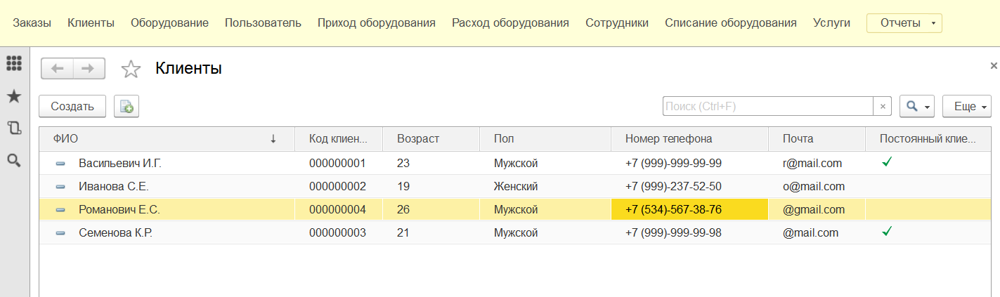
С помощью этого справочника можно узнать дополнительную информацию о
клиенте, например, такие вещи, как номер и почта, чтобы иметь связь с
клиентом и отправлять всю информацию о сеансе звукозаписи на почту, при
желании клиента. Также можно указать постоянный клиент или нет, чтобы
предоставить дополнительные скидки и акции, если заказчик уже
осуществил, как минимум три сеанса .

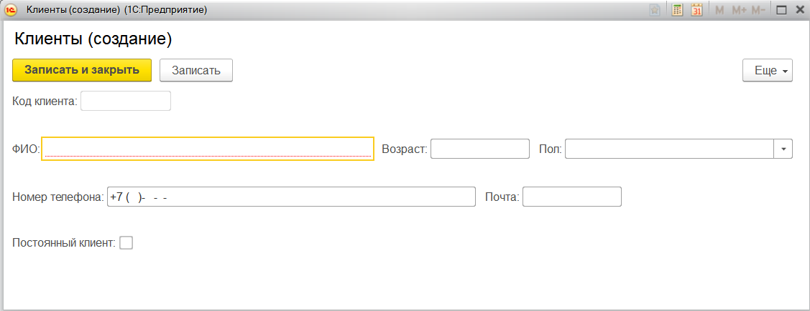
Рисунок 5 -- Форма элемента справочника «Клиенты»

Также есть справочник «Услуги», содержит информацию, в которой описаны
все услуги, предоставляемые студией, включая тип услуги, стоимость и
должность человека, который может выполнить ту или иную услугу .

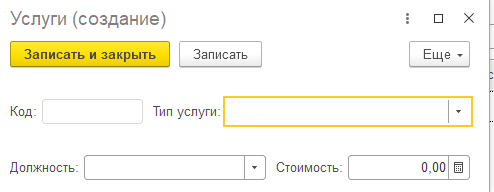

Рисунок 6 -- Форма элемента справочника «Услуги»

Справочник услуг также позволяет анализировать данные о предоставленных
услугах. Это может включать отчеты о доходах, объеме работ, популярности
определенных услуг, анализ эффективности и т. д. Анализ данных помогает
идентифицировать сильные и слабые стороны студии звукозаписи, принимать
стратегические решения и планировать дальнейшее развитие бизнеса.

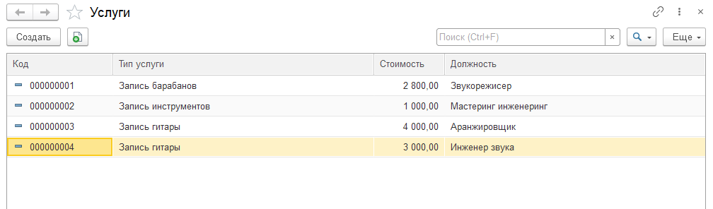
Рисунок 7 -- Форма списка справочника «Услуги»

Справочник оборудования для студии звукозаписи используется для учета и
контроля за оборудованием, используемым в студии звукозаписи . Вот
несколько причин, почему такой справочник полезен:

1.  Учет оборудования: Справочник оборудования позволяет вести учет всех
    имеющихся в студии звукозаписи устройств и оборудования. Каждое
    устройство описано с указанием его названия, серийного номера,
    стоимости и т.д.. Это помогает владельцам и управляющим студии иметь
    полную информацию о своем оборудовании.

2.  Распределение оборудования: Справочник оборудования позволяет
    отслеживать, какое оборудование находится в наличии, а какое
    используется в данный момент или арендуется другими клиентами или
    проектами. Это помогает эффективно планировать использование
    ресурсов и избегать конфликтов расписания.

3.  Страхование и гарантийное обслуживание: Справочник оборудования
    содержит информацию о гарантийных сроках для каждого устройства. Это
    позволяет следить за сроками гарантии, своевременно предпринимать
    меры при неисправностях.

> 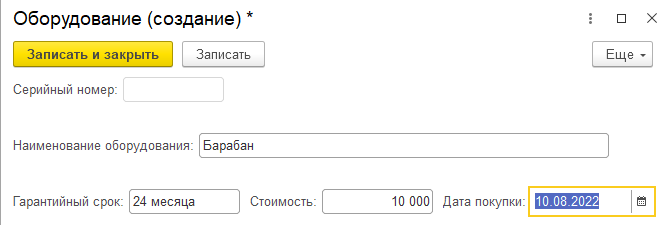

Рисунок 8 - Форма элемента справочника \"Оборудование\"

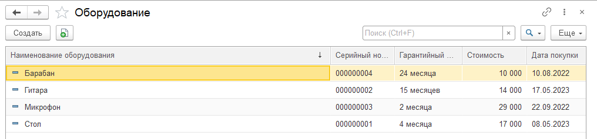
Рисунок 9 - Форма списка справочника \"Оборудование\"

Таким образом, были описаны все созданные справочники конфигурации,
которые являются ее основной составляющей. Создав эти справочники, была
заложена основа для будущей работы с документами.

### 3.2 Создание документов конфигурации

Для студии звукозаписи, документы играют важную роль в информационной
системе на базе 1С. Они представляют собой электронные аналоги
стандартных бумажных документов, используемых в студии для отражения
всех движений и изменений, происходящих в ее деятельности.

С помощью документов организуется ввод информации о совершаемых
хозяйственных операциях в систему. Например, для студии звукозаписи
могут быть созданы документы, такие как \"Заказы\", \"Списание
оборудования\" и \"Зарплатная ведомость\". Эти документы служат
основаниями для учетных действий, таких как фиксация заказов от
клиентов, составление счетов на оплату услуг, отражение выполненных
работ и т.д.

Благодаря использованию электронных документов в информационной системе
студии звукозаписи, организуется удобный ввод, просмотр и корректировка
информации. Вся необходимая информация, связанная с клиентами, заказами,
платежами и другими хозяйственными операциями, хранится в электронном
виде и может быть легко доступна для просмотра и анализа.

Таким образом, использование документов в информационной системе студии
звукозаписи на базе 1С позволяет эффективно отслеживать и контролировать
все изменения, происходящие в деятельности студии, а также обеспечивает
основу для учетных действий и расчетов, необходимых для ее
функционирования.

Для автоматизации студии были созданы следующие документы .

1)  Списание оборудования,

2)  Заказы,

3)  Зарплатная ведомость.

> 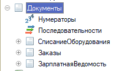
Рисунок 10 -- Документы конфигурации

Документы создаются так же, как и справочники. Однако функции документов
сильно отличаются от функций справочников.

Рассмотрим первый документ конфигурации, который называется «Списание
оборудования».

Документ \"Списание оборудования\" в информационной системе 1С для
студии звукозаписи предназначен для фиксации процесса списания
оборудования из активного использования по определенной причине. Этот
документ позволяет организовать учет и контроль за списанием
оборудования и сохранить историю изменений. При создании документа
необходимо сразу создать его форму документа и форму списка. Это
понадобится в будущем для формирования, например, начальной страницы
системы. Форма документа позволяет производить всю работу с документом,
поэтому при ее создании нужно учесть множество аспектов работы фирмы.

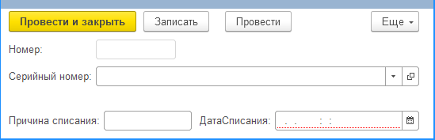

Рисунок 11-- Документ «Списание оборудования»

Реквизиты документа \"Списание оборудования\" включают следующие:

1.  Серийный номер: серийный номер оборудования, которое будет списано.
    Это уникальный идентификатор, позволяющий однозначно
    идентифицировать каждое конкретное устройство или компонент студии
    звукозаписи.

2.  Причина списания: описание причины, по которой производится списание
    оборудования. Например, это может быть устаревшее оборудование,
    вышедшее из строя, непригодное для использования и т.д.

3.  Номер: уникальный номер документа \"Списание оборудования\". Он
    служит для идентификации документа в системе и обеспечивает
    уникальность каждой записи.

4.  Дата списания: дата, когда было произведено списание оборудования.

Создание и заполнение документа \"Списание оборудования\" позволяет
точно учесть все процессы списания и иметь информацию о причинах и дате
проведения. Это обеспечивает более эффективный учет оборудования в
студии звукозаписи, а также упрощает процесс отслеживания и анализа
использования оборудования в будущем.

Кроме того, электронный документ \"Списание оборудования\" обеспечивает
возможность быстрого доступа к информации о списанном оборудовании и
позволяет легко проводить поиск и анализ данных, связанных с причинами
списания и другими характеристиками.

Документ \"Заказы\" в информационной системе 1С для студии звукозаписи
предназначен для оформления и учета заказов, поступающих от клиентов на
предоставление услуг студии. Этот документ позволяет систематизировать
информацию о заказах, контролировать их исполнение и рассчитывать
стоимость услуг.

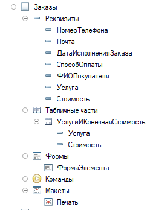

Рисунок 12 -- Реквизиты документа

Реквизиты документа \"Заказы\" включают следующие:

1.  Номер телефона (реквизит): Контактный номер телефона клиента,
    оформляющего заказ. Этот реквизит позволяет быстро идентифицировать
    клиента и связаться с ним для уточнения деталей заказа или обратной
    связи.

2.  Почта (реквизит): Адрес электронной почты клиента. Он используется
    для отправки уведомлений, подтверждений и другой важной информации,
    связанной с заказом.

3.  Дата исполнения заказа (реквизит): Дата, когда заказ должен быть
    выполнен студией звукозаписи. Это позволяет планировать работы и
    обеспечивать своевременное исполнение заказов.

4.  Способ оплаты (реквизит): Описание выбранного клиентом способа
    оплаты. Например, это может быть ссылка на систему электронных
    платежей или информация о перечислении средств на указанный счет.

5.  ФИО покупателя (реквизит): Полное имя клиента, оформляющего заказ.

6.  Услуга (реквизит): Ссылка на перечень доступных услуг студии
    звукозаписи. Клиент выбирает необходимую услугу из предложенного
    списка.

7.  Стоимость (реквизит): Стоимость выбранной услуги, указанная в
    заказе.

Табличная часть \"Услуги и конечная стоимость\" документа \"Заказы\"
включает следующие реквизиты:

1.  Номер (реквизит): Уникальный номер строки в табличной части, который
    позволяет идентифицировать каждую отдельную услугу в заказе.

2.  Услуга (реквизит): Ссылка на выбранную услугу из перечня доступных
    услуг студии звукозаписи.

3.  Стоимость (реквизит): Стоимость каждой отдельной услуги, указанная в
    заказе.

В подвале таблицы табличной части документа \"Заказы\" автоматически
высчитывается общая стоимость заказа, суммируя все стоимости услуг.

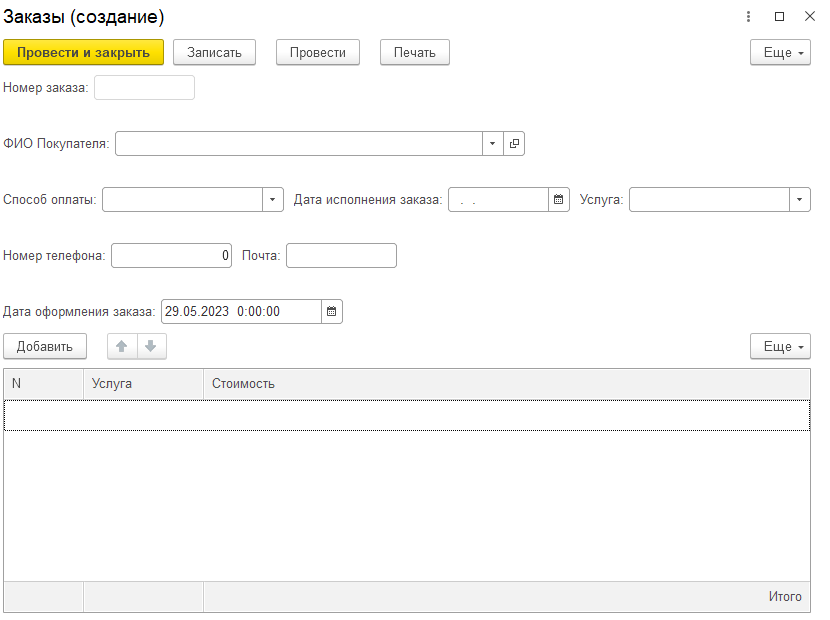

Рисунок 13 -- Форма документа «Заказы»

Создание и заполнение документа \"Заказы\" позволяет учесть все детали
заказа, включая контактную информацию клиента, выбранные услуги,
стоимость и способ оплаты. Это обеспечивает более эффективную
организацию работы студии звукозаписи и облегчает процесс отслеживания и
анализа заказов и связанных с ними операций и платежей.

Плюсом функционирования данной информационной системы является так же
то, что есть возможность печатать документы. Для этого были созданы
печатные формы документов с помощью конструктора печати.

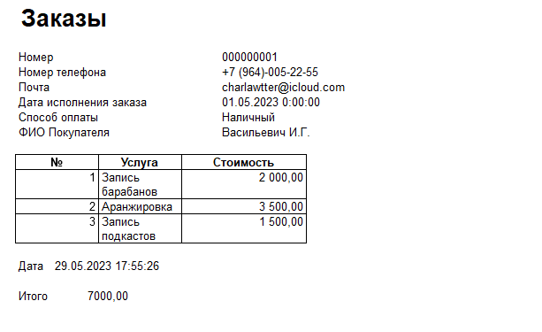

Рисунок 14 -- Печатная форма документа Заказы

Таким образом, данный документ позволяет рассчитать сумму заказа клиента
и отразить данные в системе.

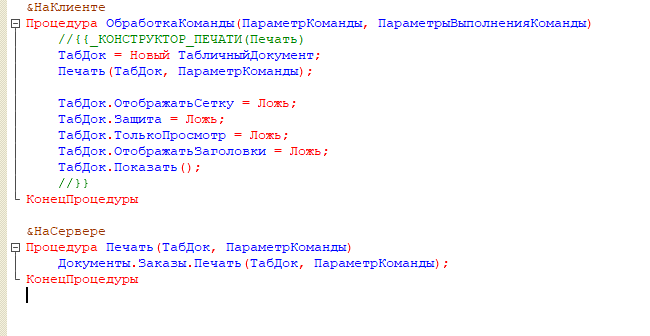

Рисунок 15 - Автоматически созданный код для печати документа

Данный код в 1С представляет собой описание двух процедур:
\"ОбработкаКоманды\" и \"Печать\". Эти процедуры используются для
выполнения операции печати документа \"Заказы\" в рамках
клиент-серверной архитектуры 1С:Предприятия.

1.  Процедура \"ОбработкаКоманды\":

    -   Принимает два параметра: \"ПараметрКоманды\" и
        \"ПараметрыВыполненияКоманды\".

    -   Создает новый объект типа \"ТабличныйДокумент\".

    -   Вызывает процедуру \"Печать\" и передает ей созданный объект
        \"ТабличныйДокумент\" и параметр \"ПараметрКоманды\".

    -   Устанавливает некоторые свойства объекта \"ТабличныйДокумент\"
        для настройки его отображения.

    -   Отображает созданный \"ТабличныйДокумент\" в пользовательском
        интерфейсе.

2.  Процедура \"Печать\":

    -   Принимает два параметра: \"ТабДок\" (объект типа
        \"ТабличныйДокумент\") и \"ПараметрКоманды\".

    -   Вызывает метод печати документа \"Заказы\" и передает ему объект
        \"ТабличныйДокумент\" и параметр \"ПараметрКоманды\".

Таким образом, данный код используется для обработки команды печати
документа \"Заказы\" в 1С:Предприятии. Процедура \"ОбработкаКоманды\"
выполняется на клиентской стороне, а процедура \"Печать\" - на серверной
стороне, где вызывается соответствующий метод печати документа.

Документ \"Заработная ведомость\" в 1С для студии звукозаписи
предназначен для учета и расчета заработной платы сотрудников за
определенный период времени.

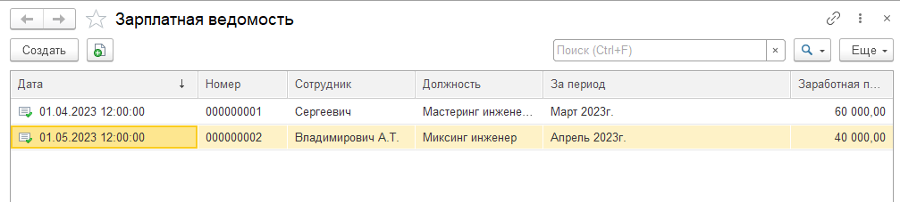
Рисунок 16 -- Документ \"Зарплатная ведомость\"

В данном документе отражаются следующие реквизиты:

1.  Сотрудник: Данный реквизит указывает на конкретного сотрудника
    студии звукозаписи, для которого проводится расчет заработной платы.
    В этом реквизите указывается информация о сотруднике, такая как его
    ФИО, табельный номер и другие идентификационные данные.

2.  Должность: Реквизит \"Должность\" указывает на должность, которую
    занимает сотрудник. Здесь указывается информация о должности
    сотрудника в студии звукозаписи, например, звукорежиссер,
    аудиоинженер, музыкант и т.д.

3.  За период: Реквизит \"За период\" определяет временной интервал, за
    который осуществляется расчет заработной платы. Здесь указывается
    начальная и конечная даты периода, за который производится расчет.

4.  Заработная плата: Данный реквизит отражает сумму заработной платы,
    начисленную сотруднику за указанный период. Здесь указывается сумма
    денежных средств, которую сотрудник получает в качестве оплаты за
    свою работу.

5.  Дата: Реквизит \"Дата\" указывает на дату составления заработной
    ведомости. Здесь указывается дата, когда документ был создан или
    подготовлен для расчета и учета заработной платы.

Документ \"Заработная ведомость\" в 1С для студии звукозаписи позволяет
вести учет и расчет заработной платы сотрудников за определенный период
времени. В этом документе можно указать информацию о каждом сотруднике,
его должности, указать период, за который осуществляется расчет, указать
сумму заработной платы и дату составления ведомости.

# 3.3 Создание подсистем

Для того чтобы информационная система была удобной и понятной для
пользователя, а также, для того, чтобы вся информация в системе была
структурирована мною были созданы следующие подсистемы:

1)  Клиенты и заказы,

2)  Оборудование,

3)  Сотрудники,

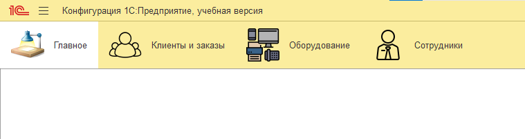

Рисунок 17-- Подсистемы

В системе 1С можно создать подсистемы для управления различными
аспектами деятельности компании. В вашем случае, рассмотрим три основные
подсистемы, связанные с оборудованием, клиентами и заказами, а также
сотрудниками.

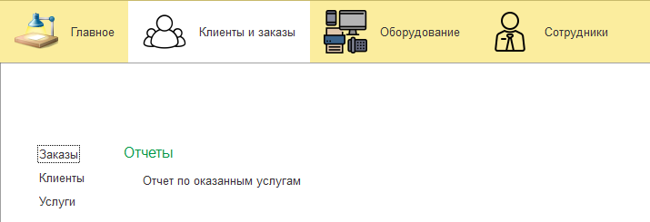

Рисунок -- Подсистемы \"Клиенты и заказы\"

1.  Подсистема \"Клиенты и заказы\":

-   Справочник \"Клиенты\": в данном справочнике содержится информация о
    клиентах студии звукозаписи. Здесь могут быть указаны данные о
    каждом клиенте, такие как ФИО, контактные данные (номер телефона,
    адрес электронной почты и др.), а также другие сведения.

-   Справочник \"Услуги\": В этом справочнике содержится информация об
    оказываемых услугах студии звукозаписи. Здесь могут быть указаны
    данные о каждой услуге, такие как наименование, описание, стоимость
    и другие характеристики.

-   Документ \"Заказы\": Этот документ используется для оформления
    заказов на оказание услуг студии звукозаписи от клиентов. В
    документе указываются реквизиты, такие как номер телефона клиента,
    адрес электронной почты, дата исполнения заказа, способ оплаты и
    другие данные, связанные с заказом.

-   Отчет \"Отчет по оказанным услугам\": Данный отчет позволяет
    анализировать оказанные услуги студии звукозаписи. В отчете могут
    быть представлены данные о клиентах, услугах, датах оказания услуги,
    стоимости и других параметрах, которые позволяют оценить
    эффективность работы студии.

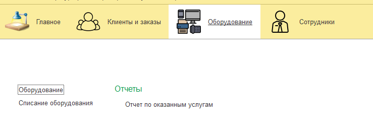

Рисунок 19 - Подсистема \"Оборудование\"

2.  Подсистема \"Оборудование\":

-   Справочник \"Оборудование\": В данном справочнике содержится
    информация о доступном оборудовании в студии звукозаписи. Здесь
    могут быть указаны данные о каждом устройстве, такие как
    наименование, модель, серийный номер, характеристики и другие
    сведения.

-   Документ \"Списание оборудования\": Этот документ используется для
    отражения списания оборудования из активного использования. В
    документе указываются реквизиты, такие как серийный номер
    оборудования, причина списания, номер и дата. После списания
    оборудования, его статус может измениться на \"Неактивный\" или
    \"Списано\".

-   Отчет \"Отчет по оказанным услугам\": Данный отчет позволяет
    анализировать оказанные услуги студии звукозаписи, включая
    информацию об использованном оборудовании. В отчете могут быть
    представлены данные о клиентах, услугах, дате и времени оказания
    услуги, а также информация о примененном оборудовании.

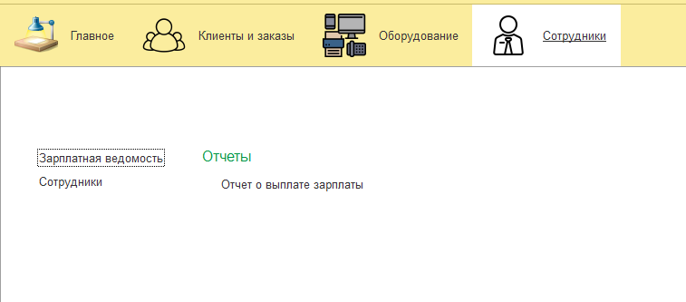

Рисунок 20 - Подсистемы \"Сотрудники\"

3.  Подсистема \"Сотрудники\":

-   Документ \"Заработная ведомость\": Этот документ используется для
    расчета заработной платы сотрудников студии звукозаписи. В документе
    указываются реквизиты, такие как сотрудник, должность, за период,
    заработная плата и дата. Заработная ведомость позволяет проводить
    расчет заработной платы с учетом различных параметров, таких как
    оклад, премии, удержания и др.

-   Справочник \"Сотрудники\": в данном справочнике содержится
    информация о сотрудниках студии звукозаписи. Здесь могут быть
    указаны данные о каждом сотруднике, такие как ФИО, должность,
    контактные данные и другая информация.

-   Отчет \"Отчет о выплате зарплаты\": Данный отчет предоставляет
    информацию о выплате заработной платы сотрудникам студии
    звукозаписи. В отчете могут быть представлены данные о каждом
    сотруднике, сумме заработной платы, дате выплаты и других
    параметрах, связанных с выплатой заработной платы.

Каждая из указанных подсистем в 1С для студии звукозаписи выполняет свои
функции и позволяет эффективно управлять и контролировать
соответствующие аспекты деятельности компании.
